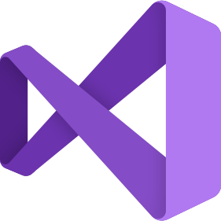
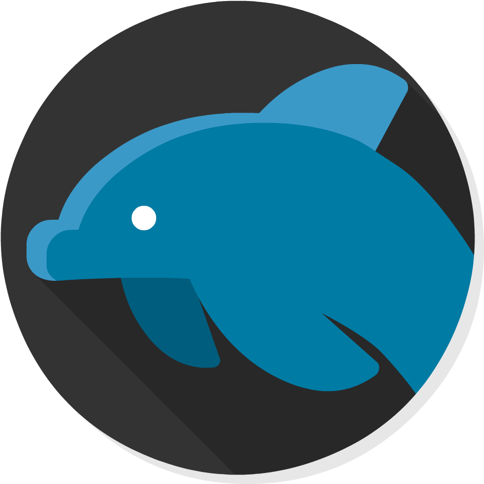

### Hi there, I'm Tanay

## I'm a Developer and a Student!

- 🌱 I’m currently learning everything 🤣
- ⚡ Fun fact: I love to make digital art / drawings
- 👨‍💻 Competitive Coder

### Spotify Playing 🎧

### Connect with me:

[][website]
[][linkedin]
[][instagram]
 

### Tools:
[][vs]
[][vs]
[][ij]
[][ij]
[][ij]
[][ij]
[][repos]

### Languages: 
[][html]
[][html]
[][html]
[][repos]
[][repos]
[][repos]
[][repos]
[][repos]
[][repos]
[][repos]
[][repos]
[][repos]
[][repos] 
 

### Stats for nerds:

[website]: https://codebea.blogspot.com
[linkedin]: https://www.linkedin.com/in/tanaykapoor/
[instagram]: https://www.instagram.com/its.tkaay/
[ij]: https://www.jetbrains.com/
[vs]: https://code.visualstudio.com/insiders/
[html]: https://github.com/TanayKapoor/HTMLS
[react]: https://github.com/TanayKapoor/React-Covid-Tracker
[repos]: https://github.com/TanayKapoor?tab=repositories
