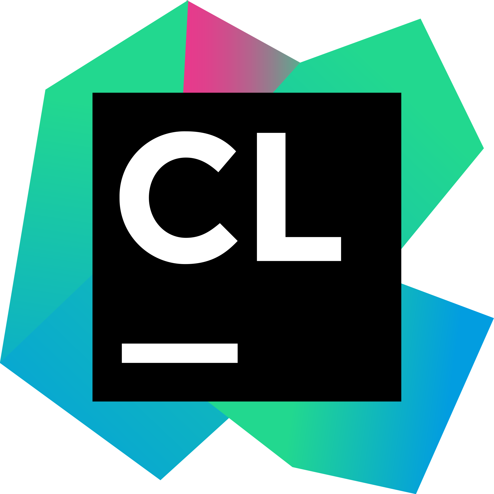

## Hi, I’m Tanay 👋

**Full-stack Developer • Competitive Programmer • Digital Artist**

---

### About Me

- 👨‍💻 Developer focused on building and learning continuously  
- 🧠 Competitive coding & problem-solving  
- 🎨 Digital art and visual experiments  
- 🌱 Exploring new tech, frameworks, and ideas  

---

### 🎧 Spotify — Now Playing

---

### Connect With Me

[][website]
[][linkedin]
[][instagram]

---

### Tools & IDEs

---

### Languages & Technologies

---

### 📊 GitHub Stats

<!-- Main Stats -->

<!-- Top Languages -->

---

### Links

[website]: https://hi-tanay.in  
[linkedin]: https://www.linkedin.com/in/tanaykapoor/  
[instagram]: https://www.instagram.com/its.tkaay/  
